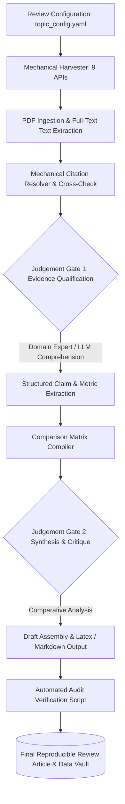

# 📑 ReviewForge — Reproducible Literature Review Engine

<div align="center">

[](LICENSE)
[](https://github.com/Kamran5H/ReviewForge)
[](https://github.com/Kamran5H/ReviewForge)
[](https://github.com/Kamran5H/ReviewForge)
[](https://github.com/Kamran5H/ReviewForge)

**A config-driven, audit-trailed engine for architecting critical, rigorous, and reproducible academic review articles.**

[Core Philosophy](#-core-philosophy) • [The ReviewForge Loop](#-the-reviewforge-loop) • [System Architecture](#-system-architecture) • [Quickstart](#-quick-start) • [License](#-license)

</div>

---

## 🌟 Core Philosophy

Most automated literature review tools fail because they treat scientific synthesis as a text generation problem rather than a **critical verification loop**. 

**ReviewForge** is distilled from the high-impact zinc–air battery electrochemistry review project. It enforces a foundational law of academic integrity:

> *"Every number an article reports must be regenerated by a script, and every claim it makes must explicitly name and verify the underlying evidence."*

ReviewForge automates the mechanical heavy lifting—harvesting metadata across APIs, parsing PDFs, compiling citation matrices, and checking formatting—while explicitly demarcating every point that requires **domain-expert judgement** (e.g., cell configuration validation, electrolyte composition discrepancies, benchmark comparability).

---

## 🔄 The ReviewForge Loop



---

## 🚀 Key Capabilities

- **⚙️ Config-Driven Execution**: Define topic bounds, keyword taxonomies, inclusion/exclusion criteria, and target metrics in clean YAML configuration files.
- **🔍 Automated Paper Harvesting**: Interfaces with CrossRef, arXiv, PubMed, OpenAlex, and Semantic Scholar to build comprehensive, deduplicated bib callsets.
- **📊 Quantitative Metric Extractor**: Parses tables, experimental text, and captions to extract operating voltages, specific capacities, current densities, and cycle life metrics into structured pandas DataFrames.
- **🛡️ Full-Trace Audit Trail**: Every synthesized paragraph links back to verifiable database IDs and exact page/paragraph references in primary source literature.
- **📑 LaTeX & Markdown Compilers**: Automatically generates publication-ready LaTeX tables, reference files (`.bib`), and formatted section drafts.

---

## 📁 Repository Structure

```text
ReviewForge/
├── reviewforge/                # Core engine package
│   ├── harvester/              # Multi-API scholarly paper crawlers
│   ├── parser/                 # PDF layout parser and table extractor
│   ├── matrix/                 # Quantitative data synthesis & metric matrix
│   ├── synthesis/              # Draft assembly and section builder
│   └── verifier/               # Citation integrity and claim verification
├── examples/                   # Reference review configurations & outputs
├── .gitignore                  # Python, SQLite & output cache exclusions
└── LICENSE                     # Open-source MIT License
```

---

## ⚡ Quick Start

### Installation
```bash
git clone https://github.com/Kamran5H/ReviewForge.git
cd ReviewForge

python -m venv .venv
.venv\Scripts\activate

pip install -r requirements.txt
```

### Run Review Pipeline
```bash
# Execute harvesting for a configured topic
python -m reviewforge.run --config examples/zinc_air_batteries.yaml
```

---

## 📜 License

This project is open-source and released under the [MIT License](LICENSE).  
Copyright (c) 2024-2026 **Kamran Ashraf**.
